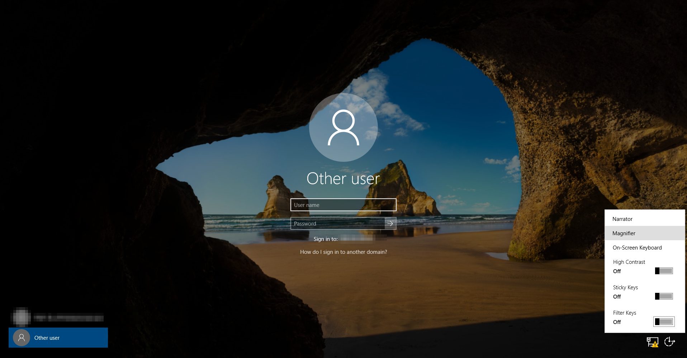
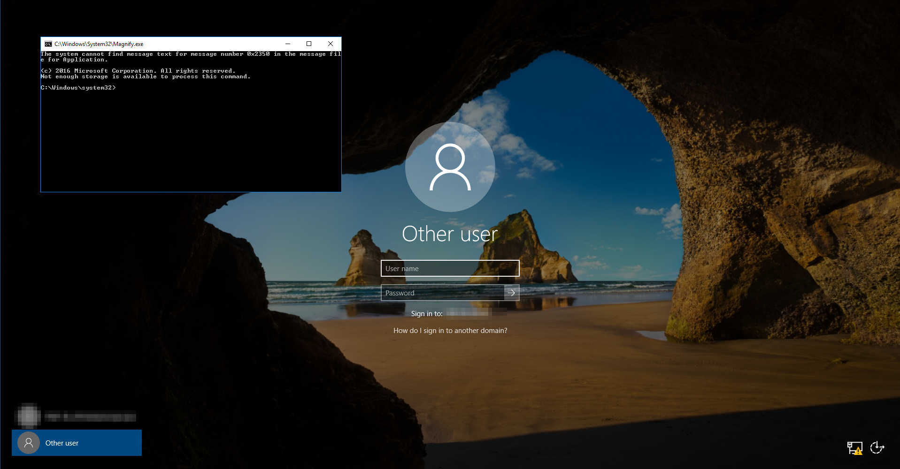

# Accessibility-swap-login-LPE

<p align="center">
  Swap a Windows accessibility binary (`Magnify.exe`, `sethc.exe`, `Utilman.exe`, ...) for `cmd.exe` inside a VirtualBox `.vdi` disk to get a `SYSTEM` command prompt from the login screen.
  <br>
  
  <a href="https://twitter.com/intent/follow?screen_name=podalirius_" title="Follow"></a>
  <a href="https://www.youtube.com/c/Podalirius_?sub_confirmation=1" title="Subscribe"></a>
  <br>
</p>

This tool implements the **Accessibility Features** login-screen privilege escalation ([MITRE ATT&CK T1546.008](https://attack.mitre.org/techniques/T1546/008/)) offline, directly against a powered-off VirtualBox `.vdi` disk. The accessibility tools reachable from the Windows lock screen are launched by `winlogon.exe` in the `NT AUTHORITY\SYSTEM` context, so replacing any of them with a copy of `cmd.exe` yields a SYSTEM shell **before any user logs in**.

You choose which accessibility binary to swap with `--target` (Sticky Keys, Magnifier, Utility Manager, On-Screen Keyboard, Narrator, ...).

It is intended for recovering access to **your own** virtual machine (for example, when you have lost the local administrator password of a lab VM).

## Features

 - [x] Swap any of the login-screen accessibility binaries — pick one with `--target`
 - [x] Reads and writes VirtualBox's VDI format directly with `qemu-nbd`
 - [x] Automatically locates the Windows partition holding `System32`
 - [x] Handles dirty / hibernated NTFS volumes by clearing the dirty flag with `ntfsfix`
 - [x] Backs up the original binary (once) to `<name>.exe.bak`
 - [x] One-command restore with `--restore`

## Supported accessibility targets

| `--target`      | System32 binary     | How to trigger it on the login screen                     |
|-----------------|---------------------|-----------------------------------------------------------|
| `sethc`         | `sethc.exe`         | Press <kbd>Shift</kbd> five times (Sticky Keys)           |
| `utilman`       | `Utilman.exe`       | Press <kbd>Win</kbd>+<kbd>U</kbd> / Ease of Access button |
| `magnify`       | `Magnify.exe`       | Ease of Access → Magnifier *(default)*                    |
| `osk`           | `osk.exe`           | Ease of Access → On-Screen Keyboard                       |
| `narrator`      | `Narrator.exe`      | Press <kbd>Win</kbd>+<kbd>Ctrl</kbd>+<kbd>Enter</kbd>     |
| `displayswitch` | `DisplaySwitch.exe` | Press <kbd>Win</kbd>+<kbd>P</kbd>                          |
| `atbroker`      | `AtBroker.exe`      | Assistive Technology broker                               |

## Usage

```
$ ./Accessibility-swap-login-LPE.py -h
usage: Accessibility-swap-login-LPE.py [-h] [-t TARGET] [--restore] vdi

Replace a Windows accessibility binary (Magnify.exe, sethc.exe, Utilman.exe, ...)
with cmd.exe inside a VirtualBox .vdi disk, so triggering that accessibility
feature on the login screen spawns a SYSTEM command prompt.

positional arguments:
  vdi                   Path to the .vdi disk file

options:
  -h, --help            show this help message and exit
  -t TARGET, --target TARGET
                        Accessibility binary to swap with cmd.exe: atbroker,
                        displayswitch, magnify, narrator, osk, sethc, utilman
                        (default: magnify)
  --restore             Restore the original accessibility binary from backup
```

## Requirements

 - Linux, with `qemu-utils` (for `qemu-nbd`) and `ntfs-3g` installed:
   ```bash
   sudo apt install qemu-utils ntfs-3g
   ```
 - `root` privileges (attaching an NBD device and mounting a partition require it).
 - The target VirtualBox VM must be **powered off** (never run this against a disk that is in use).

## Demonstration

Swap the Magnifier for `cmd.exe` inside the disk (use `--target sethc` for Sticky Keys, etc.):

```bash
sudo ./Accessibility-swap-login-LPE.py /path/to/disk.vdi --target magnify
```

```
[+] Windows install found on /dev/nbd0p2
[+] Backed up original Magnify.exe -> Magnify.exe.bak
[+] Replaced Windows/System32/Magnify.exe with cmd.exe
[+] Done. Boot the VM and, on the login screen, Ease of Access -> Magnifier to get a SYSTEM command prompt.
```

Then boot the VM, and on the Windows login screen click the **Ease of Access** button, enable **Magnifier**, and a `cmd.exe` window running as `NT AUTHORITY\SYSTEM` opens.






From there you can, for example, reset a local account password (`P@ssw0rd!` is an example, please don't use that):

```bat
net user Administrator P@ssw0rd!
```

Once you are done, restore the original binary so the accessibility feature works again (pass the same `--target` you used to swap):

```bash
sudo ./Accessibility-swap-login-LPE.py /path/to/disk.vdi --target magnify --restore
```

```
[+] Windows install found on /dev/nbd0p2
[+] Restored original Magnify.exe and removed Magnify.exe.bak
```

## How it works

 * `qemu-nbd` exposes the `.vdi` as a block device (`/dev/nbdN`). This is the most reliable way to read **and** write VirtualBox's VDI block format from Linux.
 * The Windows partition (the one holding `Windows/System32/cmd.exe`) is mounted with `ntfs-3g`. If the volume is left dirty by Windows fast-startup / hibernation, the dirty flag is cleared with `ntfsfix` so it can be mounted read-write.
 * The chosen accessibility binary is backed up (once) to `<name>.exe.bak` and overwritten with a copy of `cmd.exe`.

The accessibility tools reachable from the login screen are launched by `winlogon.exe`, which runs in the `SYSTEM` context — hence the resulting command prompt inherits those privileges. This is the offline equivalent of the classic on-disk `sethc.exe` / `Utilman.exe` swap described in MITRE ATT&CK T1546.008.

## Mitigations

 - Enable BitLocker (or full-disk encryption) so the offline disk cannot be modified.
 - Never leave lab / production VMs powered off with unencrypted disks that untrusted parties can reach.
 - Windows can detect accessibility-binary tampering when Secure Boot and image integrity checks are enforced.

## References

 - https://attack.mitre.org/techniques/T1546/008/
 - https://learn.microsoft.com/en-us/windows/win32/winauto/microsoft-active-accessibility

## Contributing

Pull requests are welcome. Feel free to open an issue if you want to add other features.
